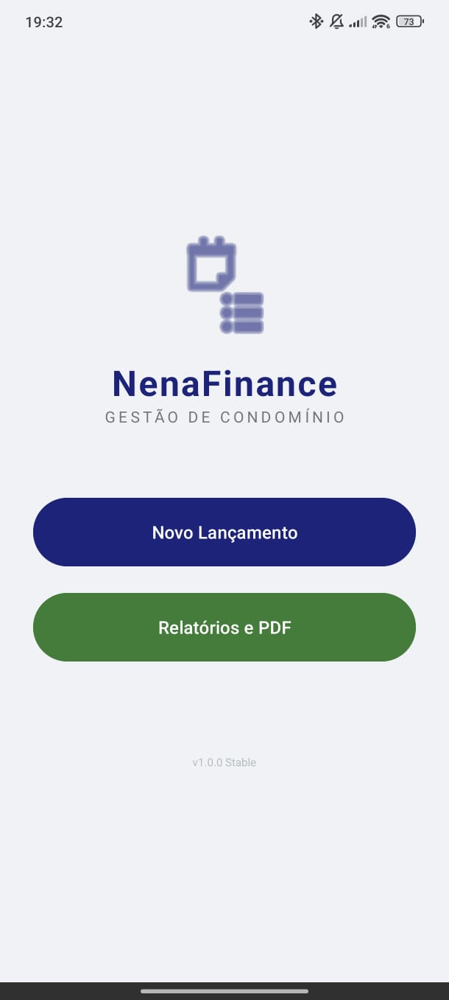
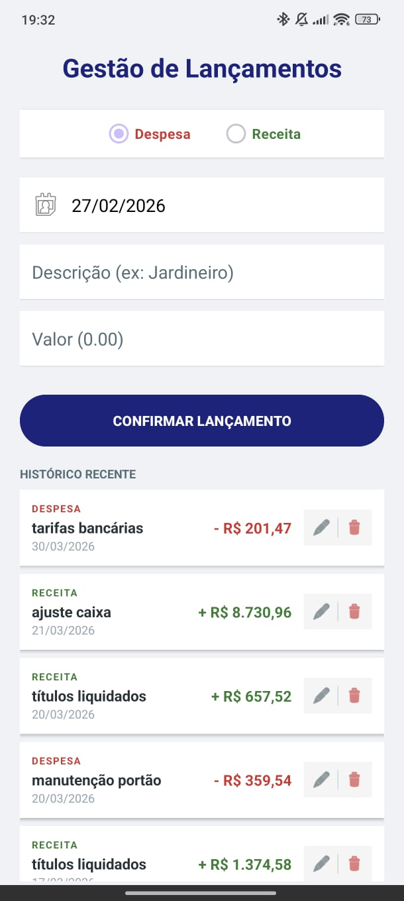
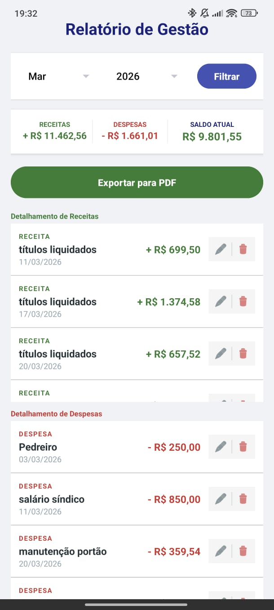
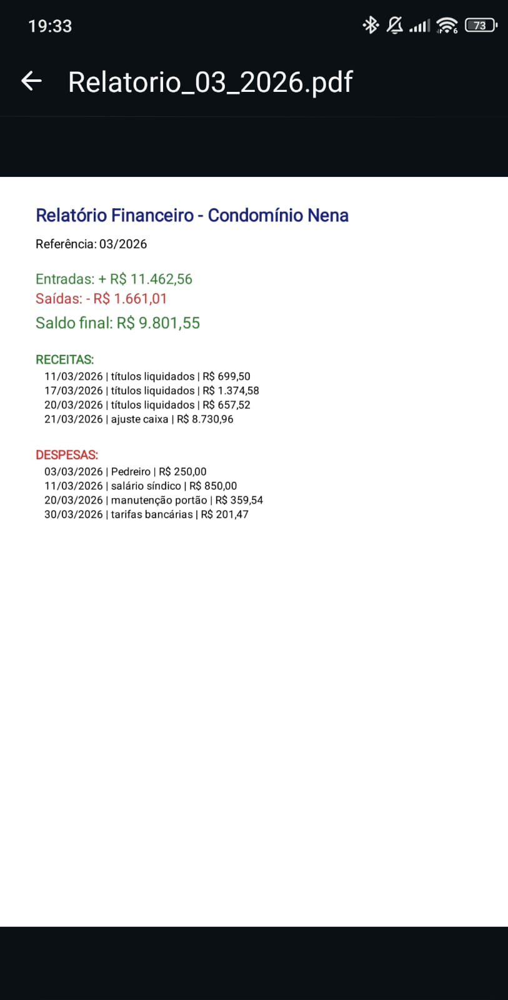

# CondoFinance (Nena Finance)

Aplicativo Android desenvolvido em **Java** para controle de receitas e despesas de condomínio.

Projeto da disciplina **Programação para Dispositivos Móveis**.

---

## 📱 Funcionalidades

- Cadastro de receitas e despesas
- Edição e exclusão de lançamentos
- Histórico recente
- Relatório por mês/ano
- Exportação de relatório em PDF
- Compartilhamento do PDF

---

## 🛠 Tecnologias utilizadas

- Java
- Android SDK
- SQLite
- XML Layout
- FileProvider (compartilhamento de PDF)

---

## 📦 APK para testes

Baixar última versão:
👉 [Download do APK](../../releases/latest)

> Para instalar, habilite a opção "Permitir instalação de apps desconhecidos" no Android.

---

## 📸 Prints do aplicativo

### Tela Inicial

### Tela de Lançamentos

### Tela de Relatórios

### Compartilhamento de PDF
